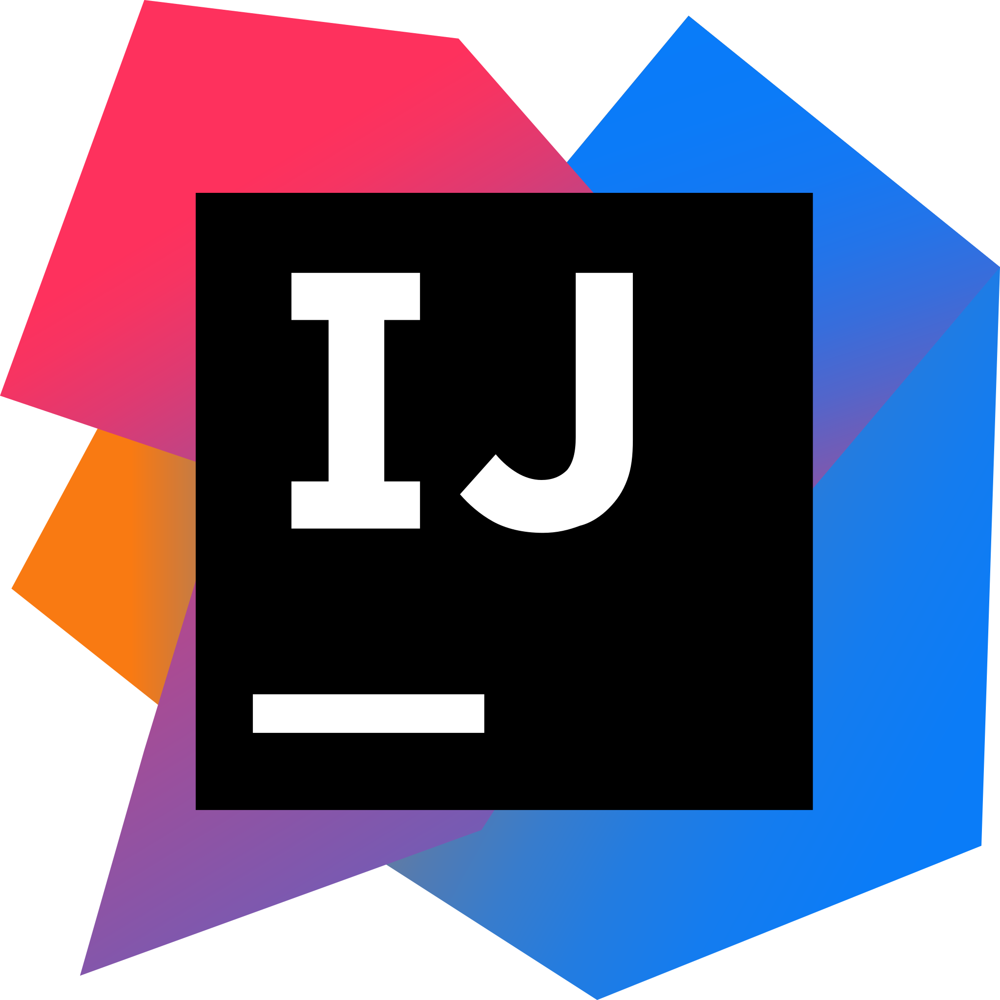

### Ciao 👋, I'm Marco, an Italian Software Engineer.
#### A man with a growing mindset that is committed to a life of learning.

I love to work on my projects and, in this page, you will find some repositorys that I have created for various tests or researches, and repository that I have created for me and I'm currently working on.

## Some things about me :

- 🔭 I’m currently working on a **[Personal-Finance-System](https://github.com/syncoGitHub/PersonalFinanceSystem)** in C++/QT 
- 🌱 I’m currently learning *Full Stack Development* on Cloud
- 👯 I’m looking to collaborate on Web or Finance related Projects 
- 😄 Pronouns: He/His 
- 🌟 Nickname: *Sync*

## 📝 Languages :

 
     
     
     
     
     
     
     
     
     
     

## 🚀 Technologies, Frameworks and Tools :

 
     
          
     
     
     
     
     
     
     
     
     
     
     
     

   <h2>📚 My certifications : </h2>
     

           
          
     

     <h2>📫 Connect with me : </h2>
     

          
          
          
          
     

  
